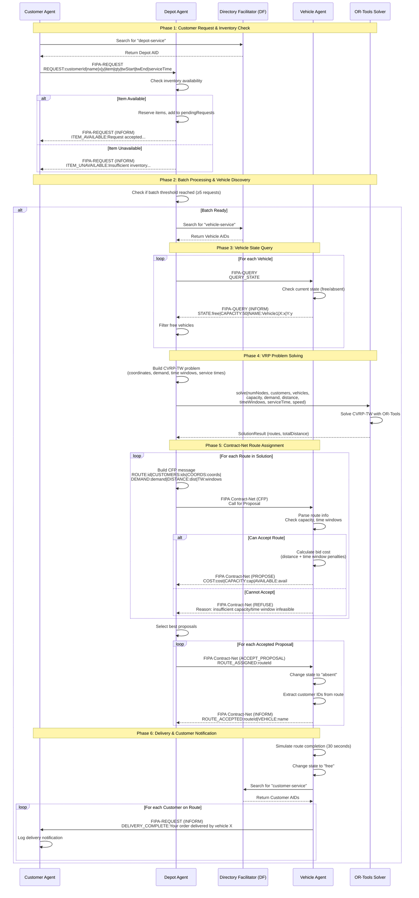
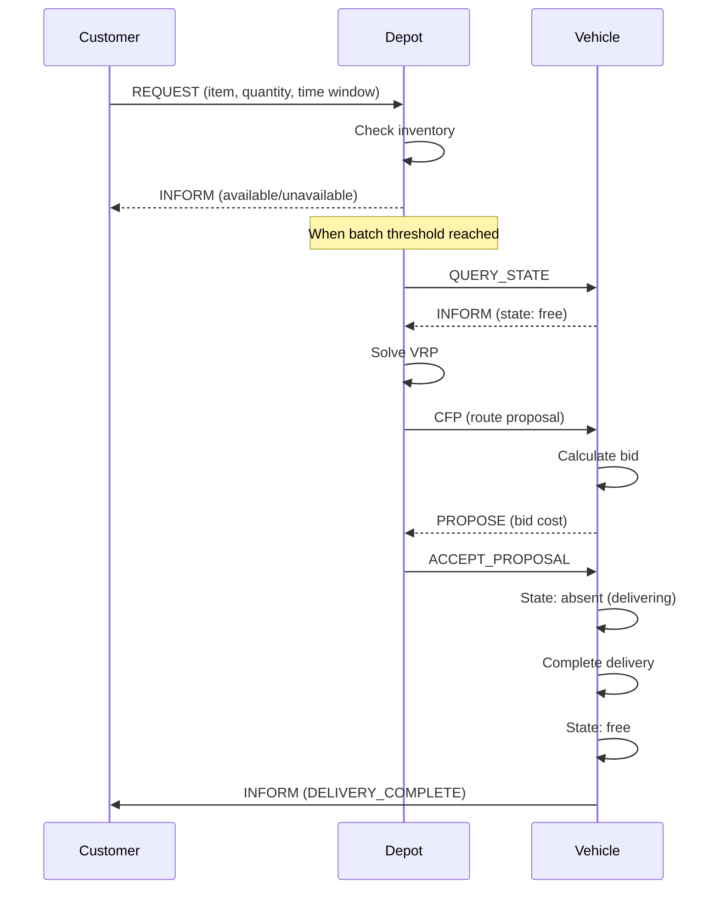
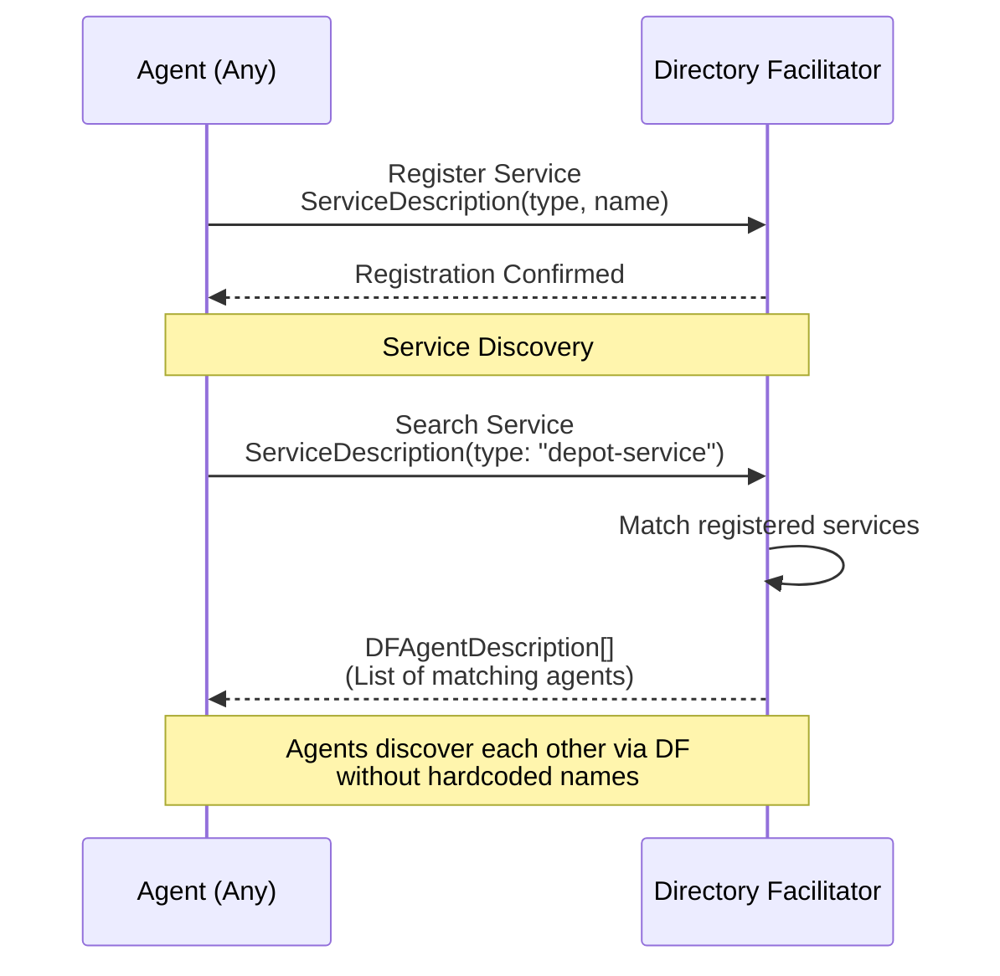
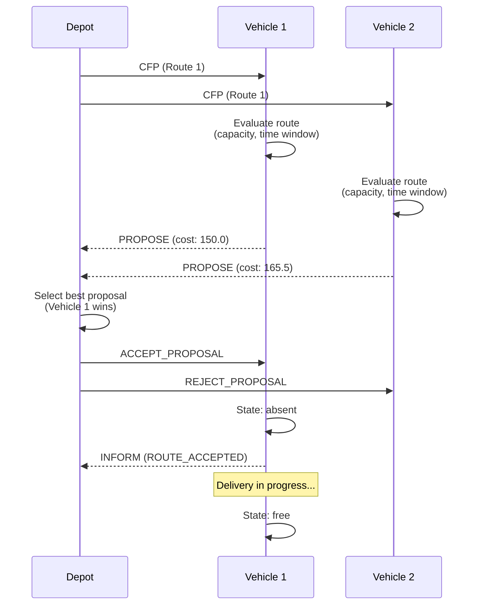

# CVRP-TW Multi-Agent System - Sequence Diagram

## Complete Service Call Sequence

```mermaid
sequenceDiagram
    participant C as Customer Agent
    participant D as Depot Agent
    participant DF as Directory Facilitator (DF)
    participant V as Vehicle Agent
    participant S as OR-Tools Solver

    Note over C,S: Phase 1: Customer Request & Inventory Check
    
    C->>DF: Search for "depot-service"
    DF-->>C: Return Depot AID
    C->>D: FIPA-REQUEST<br/>REQUEST:customerId|name|x|y|item|qty|twStart|twEnd|serviceTime
    D->>D: Check inventory availability
    alt Item Available
        D->>D: Reserve items, add to pendingRequests
        D-->>C: FIPA-REQUEST (INFORM)<br/>ITEM_AVAILABLE:Request accepted...
    else Item Unavailable
        D-->>C: FIPA-REQUEST (INFORM)<br/>ITEM_UNAVAILABLE:Insufficient inventory...
    end
    
    Note over C,S: Phase 2: Batch Processing & Vehicle Discovery
    
    D->>D: Check if batch threshold reached (≥5 requests)
    alt Batch Ready
        D->>DF: Search for "vehicle-service"
        DF-->>D: Return Vehicle AIDs
        
        Note over D,V: Phase 3: Vehicle State Query
        
        loop For each Vehicle
            D->>V: FIPA-QUERY<br/>QUERY_STATE
            V->>V: Check current state (free/absent)
            V-->>D: FIPA-QUERY (INFORM)<br/>STATE:free|CAPACITY:50|NAME:Vehicle1|X:x|Y:y
            D->>D: Filter free vehicles
        end
        
        Note over D,S: Phase 4: VRP Problem Solving
        
        D->>D: Build CVRP-TW problem<br/>(coordinates, demand, time windows, service times)
        D->>S: solve(numNodes, customers, vehicles,<br/>capacity, demand, distance,<br/>timeWindows, serviceTime, speed)
        S->>S: Solve CVRP-TW with OR-Tools
        S-->>D: SolutionResult (routes, totalDistance)
        
        Note over D,V: Phase 5: Contract-Net Route Assignment
        
        loop For each Route in Solution
            D->>D: Build CFP message<br/>ROUTE:id|CUSTOMERS:ids|COORDS:coords|<br/>DEMAND:demand|DISTANCE:dist|TW:windows
            D->>V: FIPA Contract-Net (CFP)<br/>Call for Proposal
            V->>V: Parse route info<br/>Check capacity, time windows
            alt Can Accept Route
                V->>V: Calculate bid cost<br/>(distance + time window penalties)
                V-->>D: FIPA Contract-Net (PROPOSE)<br/>COST:cost|CAPACITY:cap|AVAILABLE:avail
            else Cannot Accept
                V-->>D: FIPA Contract-Net (REFUSE)<br/>Reason: insufficient capacity/time window infeasible
            end
        end
        
        D->>D: Select best proposals
        loop For each Accepted Proposal
            D->>V: FIPA Contract-Net (ACCEPT_PROPOSAL)<br/>ROUTE_ASSIGNED:routeId
            V->>V: Change state to "absent"
            V->>V: Extract customer IDs from route
            V-->>D: FIPA Contract-Net (INFORM)<br/>ROUTE_ACCEPTED:routeId|VEHICLE:name
        end
        
        Note over V,C: Phase 6: Delivery & Customer Notification
        
        V->>V: Simulate route completion (30 seconds)
        V->>V: Change state to "free"
        V->>DF: Search for "customer-service"
        DF-->>V: Return Customer AIDs
        loop For each Customer on Route
            V->>C: FIPA-REQUEST (INFORM)<br/>DELIVERY_COMPLETE:Your order delivered by vehicle X
            C->>C: Log delivery notification
        end
    end
```

## Simplified Request Flow

```mermaid
sequenceDiagram
    participant C as Customer
    participant D as Depot
    participant V as Vehicle
    
    C->>D: REQUEST (item, quantity, time window)
    D->>D: Check inventory
    D-->>C: INFORM (available/unavailable)
    
    Note over D: When batch threshold reached
    
    D->>V: QUERY_STATE
    V-->>D: INFORM (state: free)
    D->>D: Solve VRP
    D->>V: CFP (route proposal)
    V->>V: Calculate bid
    V-->>D: PROPOSE (bid cost)
    D->>V: ACCEPT_PROPOSAL
    V->>V: State: absent (delivering)
    V->>V: Complete delivery
    V->>V: State: free
    V->>C: INFORM (DELIVERY_COMPLETE)
```

## DF Discovery Sequence

```mermaid
sequenceDiagram
    participant A as Agent (Any)
    participant DF as Directory Facilitator
    
    A->>DF: Register Service<br/>ServiceDescription(type, name)
    DF-->>A: Registration Confirmed
    
    Note over A,DF: Service Discovery
    
    A->>DF: Search Service<br/>ServiceDescription(type: "depot-service")
    DF->>DF: Match registered services
    DF-->>A: DFAgentDescription[]<br/>(List of matching agents)
    
    Note over A,DF: Agents discover each other via DF<br/>without hardcoded names
```

## Contract-Net Protocol Detail

```mermaid
sequenceDiagram
    participant D as Depot
    participant V1 as Vehicle 1
    participant V2 as Vehicle 2
    
    D->>V1: CFP (Route 1)
    D->>V2: CFP (Route 1)
    
    V1->>V1: Evaluate route<br/>(capacity, time window)
    V2->>V2: Evaluate route<br/>(capacity, time window)
    
    V1-->>D: PROPOSE (cost: 150.0)
    V2-->>D: PROPOSE (cost: 165.5)
    
    D->>D: Select best proposal<br/>(Vehicle 1 wins)
    
    D->>V1: ACCEPT_PROPOSAL
    D->>V2: REJECT_PROPOSAL
    
    V1->>V1: State: absent
    V1-->>D: INFORM (ROUTE_ACCEPTED)
    
    Note over V1: Delivery in progress...
    
    V1->>V1: State: free
```

