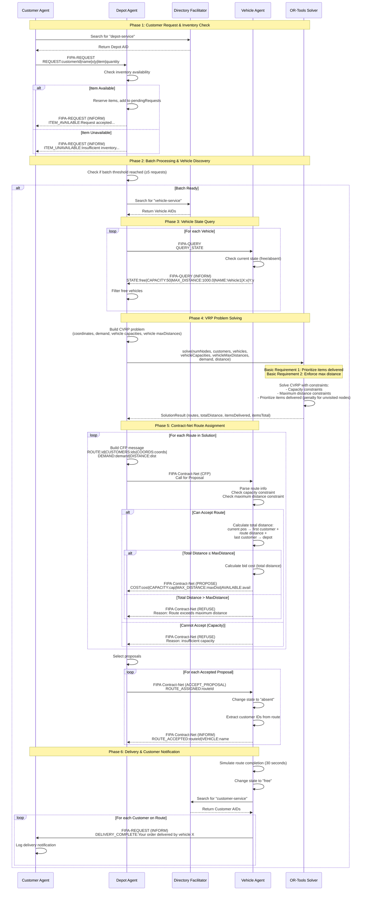
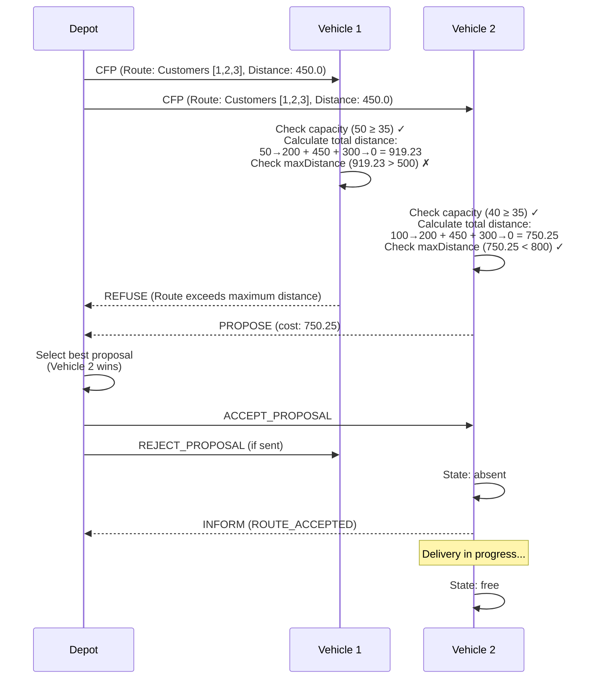
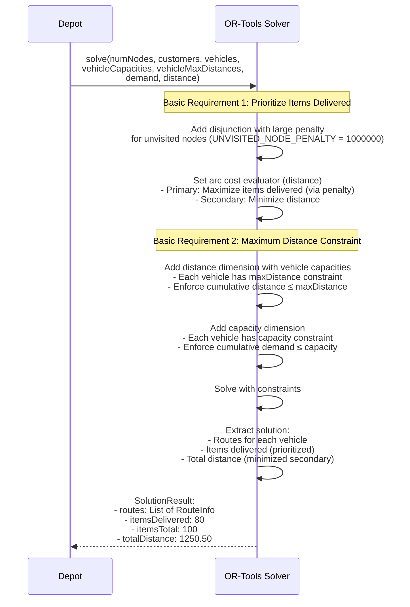
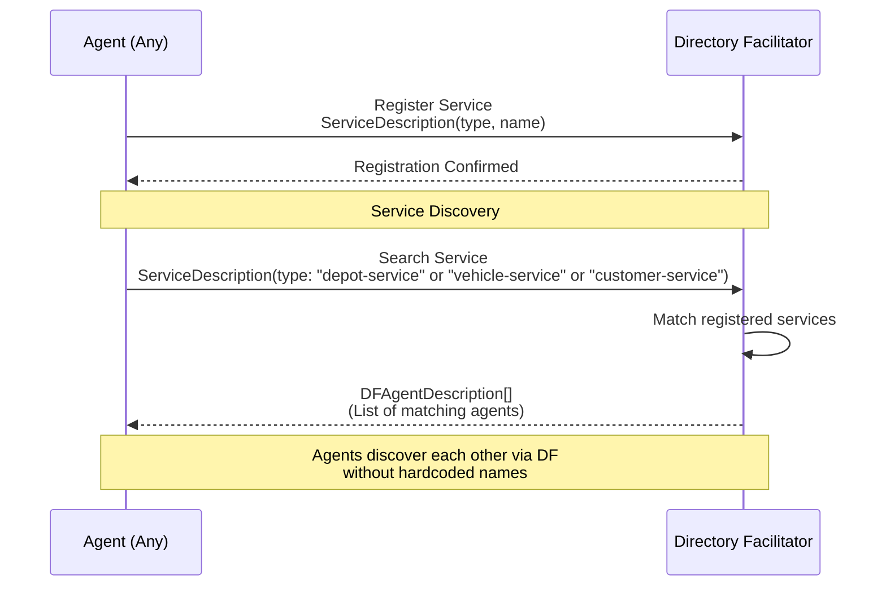

# Sequence Diagram - Basic Requirements 1 & 2

## Complete System Sequence Diagram

```mermaid
sequenceDiagram
    participant C as Customer Agent
    participant D as Depot Agent
    participant DF as Directory Facilitator
    participant V as Vehicle Agent
    participant S as OR-Tools Solver

    Note over C,S: Phase 1: Customer Request & Inventory Check
    
    C->>DF: Search for "depot-service"
    DF-->>C: Return Depot AID
    C->>D: FIPA-REQUEST<br/>REQUEST:customerId|name|x|y|item|quantity
    D->>D: Check inventory availability
    alt Item Available
        D->>D: Reserve items, add to pendingRequests
        D-->>C: FIPA-REQUEST (INFORM)<br/>ITEM_AVAILABLE:Request accepted...
    else Item Unavailable
        D-->>C: FIPA-REQUEST (INFORM)<br/>ITEM_UNAVAILABLE:Insufficient inventory...
    end
    
    Note over C,S: Phase 2: Batch Processing & Vehicle Discovery
    
    D->>D: Check if batch threshold reached (≥5 requests)
    alt Batch Ready
        D->>DF: Search for "vehicle-service"
        DF-->>D: Return Vehicle AIDs
        
        Note over D,V: Phase 3: Vehicle State Query
        
        loop For each Vehicle
            D->>V: FIPA-QUERY<br/>QUERY_STATE
            V->>V: Check current state (free/absent)
            V-->>D: FIPA-QUERY (INFORM)<br/>STATE:free|CAPACITY:50|MAX_DISTANCE:1000.0|NAME:Vehicle1|X:x|Y:y
            D->>D: Filter free vehicles
        end
        
        Note over D,S: Phase 4: VRP Problem Solving
        
        D->>D: Build CVRP problem<br/>(coordinates, demand, vehicle capacities, vehicle maxDistances)
        D->>S: solve(numNodes, customers, vehicles,<br/>vehicleCapacities, vehicleMaxDistances,<br/>demand, distance)
        Note over S: Basic Requirement 1: Prioritize items delivered<br/>Basic Requirement 2: Enforce max distance
        S->>S: Solve CVRP with constraints:<br/>- Capacity constraints<br/>- Maximum distance constraints<br/>- Prioritize items delivered (penalty for unvisited nodes)
        S-->>D: SolutionResult (routes, totalDistance, itemsDelivered, itemsTotal)
        
        Note over D,V: Phase 5: Contract-Net Route Assignment
        
        loop For each Route in Solution
            D->>D: Build CFP message<br/>ROUTE:id|CUSTOMERS:ids|COORDS:coords|<br/>DEMAND:demand|DISTANCE:dist
            D->>V: FIPA Contract-Net (CFP)<br/>Call for Proposal
            V->>V: Parse route info<br/>Check capacity constraint<br/>Check maximum distance constraint
            alt Can Accept Route
                V->>V: Calculate total distance:<br/>current pos → first customer +<br/>route distance +<br/>last customer → depot
                alt Total Distance ≤ MaxDistance
                    V->>V: Calculate bid cost (total distance)
                    V-->>D: FIPA Contract-Net (PROPOSE)<br/>COST:cost|CAPACITY:cap|MAX_DISTANCE:maxDist|AVAILABLE:avail
                else Total Distance > MaxDistance
                    V-->>D: FIPA Contract-Net (REFUSE)<br/>Reason: Route exceeds maximum distance
                end
            else Cannot Accept (Capacity)
                V-->>D: FIPA Contract-Net (REFUSE)<br/>Reason: insufficient capacity
            end
        end
        
        D->>D: Select proposals
        loop For each Accepted Proposal
            D->>V: FIPA Contract-Net (ACCEPT_PROPOSAL)<br/>ROUTE_ASSIGNED:routeId
            V->>V: Change state to "absent"
            V->>V: Extract customer IDs from route
            V-->>D: FIPA Contract-Net (INFORM)<br/>ROUTE_ACCEPTED:routeId|VEHICLE:name
        end
        
        Note over V,C: Phase 6: Delivery & Customer Notification
        
        V->>V: Simulate route completion (30 seconds)
        V->>V: Change state to "free"
        V->>DF: Search for "customer-service"
        DF-->>V: Return Customer AIDs
        loop For each Customer on Route
            V->>C: FIPA-REQUEST (INFORM)<br/>DELIVERY_COMPLETE:Your order delivered by vehicle X
            C->>C: Log delivery notification
        end
    end
```

## Contract-Net Protocol with Distance Constraint

```mermaid
sequenceDiagram
    participant D as Depot
    participant V1 as Vehicle 1
    participant V2 as Vehicle 2
    
    D->>V1: CFP (Route: Customers [1,2,3], Distance: 450.0)
    D->>V2: CFP (Route: Customers [1,2,3], Distance: 450.0)
    
    V1->>V1: Check capacity (50 ≥ 35) ✓<br/>Calculate total distance:<br/>50→200 + 450 + 300→0 = 919.23<br/>Check maxDistance (919.23 > 500) ✗
    V2->>V2: Check capacity (40 ≥ 35) ✓<br/>Calculate total distance:<br/>100→200 + 450 + 300→0 = 750.25<br/>Check maxDistance (750.25 < 800) ✓
    
    V1-->>D: REFUSE (Route exceeds maximum distance)
    V2-->>D: PROPOSE (cost: 750.25)
    
    D->>D: Select best proposal<br/>(Vehicle 2 wins)
    
    D->>V2: ACCEPT_PROPOSAL
    D->>V1: REJECT_PROPOSAL (if sent)
    
    V2->>V2: State: absent
    V2-->>D: INFORM (ROUTE_ACCEPTED)
    
    Note over V2: Delivery in progress...
    
    V2->>V2: State: free
```

## VRP Solving with Constraints

```mermaid
sequenceDiagram
    participant D as Depot
    participant S as OR-Tools Solver
    
    D->>S: solve(numNodes, customers, vehicles,<br/>vehicleCapacities, vehicleMaxDistances,<br/>demand, distance)
    
    Note over S: Basic Requirement 1: Prioritize Items Delivered
    S->>S: Add disjunction with large penalty<br/>for unvisited nodes (UNVISITED_NODE_PENALTY = 1000000)
    S->>S: Set arc cost evaluator (distance)<br/>- Primary: Maximize items delivered (via penalty)<br/>- Secondary: Minimize distance
    
    Note over S: Basic Requirement 2: Maximum Distance Constraint
    S->>S: Add distance dimension with vehicle capacities<br/>- Each vehicle has maxDistance constraint<br/>- Enforce cumulative distance ≤ maxDistance
    
    S->>S: Add capacity dimension<br/>- Each vehicle has capacity constraint<br/>- Enforce cumulative demand ≤ capacity
    
    S->>S: Solve with constraints
    S->>S: Extract solution:<br/>- Routes for each vehicle<br/>- Items delivered (prioritized)<br/>- Total distance (minimized secondary)
    
    S-->>D: SolutionResult:<br/>- routes: List of RouteInfo<br/>- itemsDelivered: 80<br/>- itemsTotal: 100<br/>- totalDistance: 1250.50
```

## DF Discovery Sequence

```mermaid
sequenceDiagram
    participant A as Agent (Any)
    participant DF as Directory Facilitator
    
    A->>DF: Register Service<br/>ServiceDescription(type, name)
    DF-->>A: Registration Confirmed
    
    Note over A,DF: Service Discovery
    
    A->>DF: Search Service<br/>ServiceDescription(type: "depot-service" or "vehicle-service" or "customer-service")
    DF->>DF: Match registered services
    DF-->>A: DFAgentDescription[]<br/>(List of matching agents)
    
    Note over A,DF: Agents discover each other via DF<br/>without hardcoded names
```

