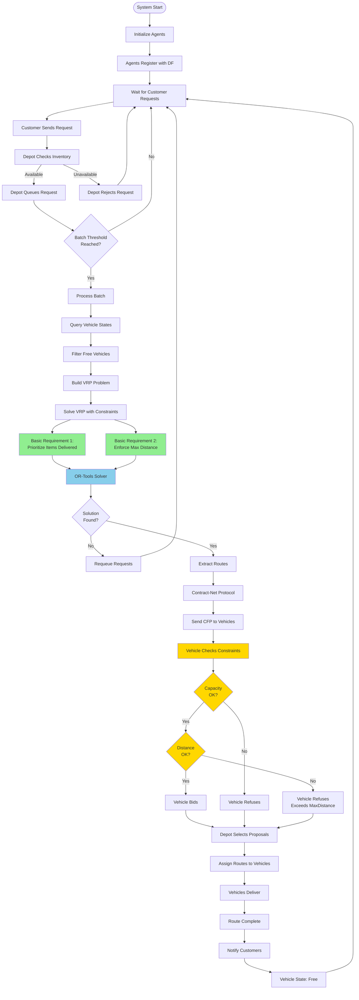
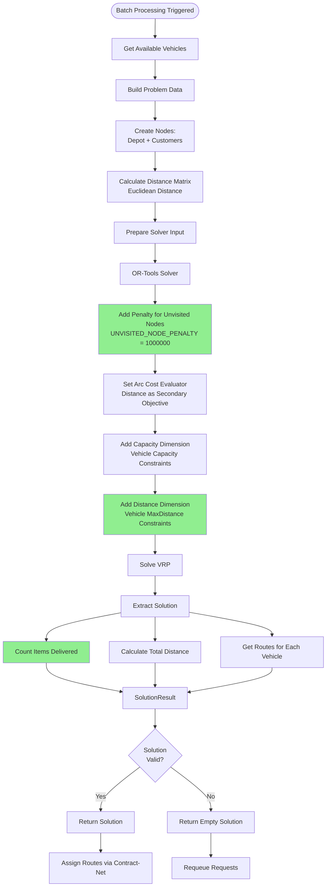
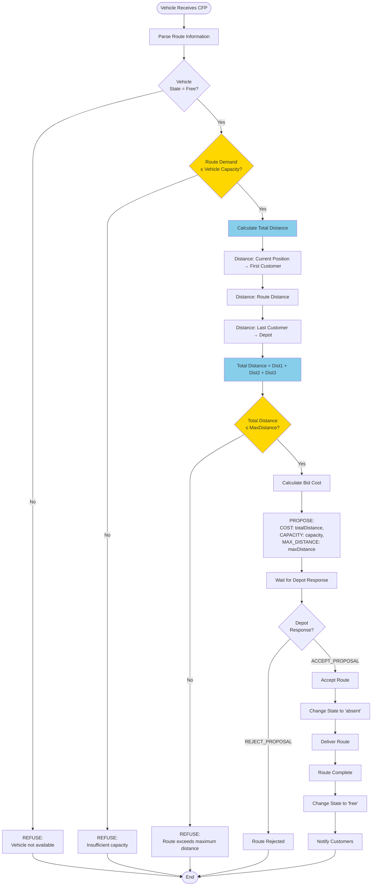
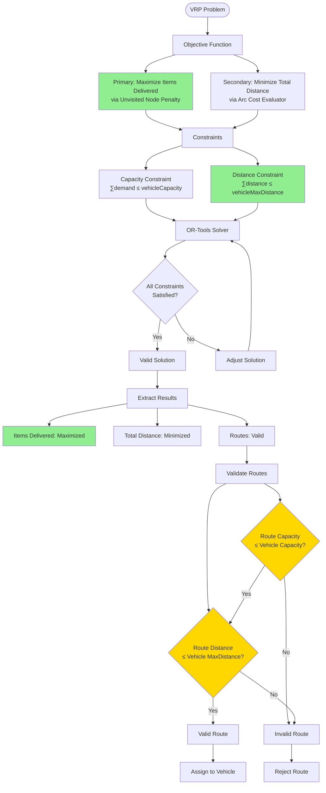

# Workflow Diagram - Basic Requirements 1 & 2

## System Workflow Overview

```mermaid
flowchart TD
    Start([System Start]) --> Init[Initialize Agents]
    Init --> RegDF[Agents Register with DF]
    RegDF --> Wait[Wait for Customer Requests]
    
    Wait --> CReq[Customer Sends Request]
    CReq --> DCheck[Depot Checks Inventory]
    
    DCheck -->|Available| DQueue[Depot Queues Request]
    DCheck -->|Unavailable| DReject[Depot Rejects Request]
    
    DQueue --> BatchCheck{Batch Threshold<br/>Reached?}
    BatchCheck -->|No| Wait
    BatchCheck -->|Yes| BatchProc[Process Batch]
    
    BatchProc --> VQuery[Query Vehicle States]
    VQuery --> VFilter[Filter Free Vehicles]
    VFilter --> BuildProb[Build VRP Problem]
    
    BuildProb --> Solve[Solve VRP with Constraints]
    
    Solve --> BR1[Basic Requirement 1:<br/>Prioritize Items Delivered]
    Solve --> BR2[Basic Requirement 2:<br/>Enforce Max Distance]
    
    BR1 --> Solver[OR-Tools Solver]
    BR2 --> Solver
    
    Solver --> Solution{Solution<br/>Found?}
    Solution -->|No| Requeue[Requeue Requests]
    Solution -->|Yes| Routes[Extract Routes]
    
    Routes --> CN[Contract-Net Protocol]
    CN --> CFP[Send CFP to Vehicles]
    
    CFP --> VCheck[Vehicle Checks Constraints]
    VCheck --> CapCheck{Capacity<br/>OK?}
    CapCheck -->|No| VRefuse1[Vehicle Refuses]
    CapCheck -->|Yes| DistCheck{Distance<br/>OK?}
    
    DistCheck -->|No| VRefuse2[Vehicle Refuses<br/>Exceeds MaxDistance]
    DistCheck -->|Yes| VBid[Vehicle Bids]
    
    VBid --> DSelect[Depot Selects Proposals]
    VRefuse1 --> DSelect
    VRefuse2 --> DSelect
    
    DSelect --> Assign[Assign Routes to Vehicles]
    Assign --> Deliver[Vehicles Deliver]
    
    Deliver --> Complete[Route Complete]
    Complete --> Notify[Notify Customers]
    Notify --> VFree[Vehicle State: Free]
    VFree --> Wait
    
    Requeue --> Wait
    DReject --> Wait
    
    style BR1 fill:#90EE90
    style BR2 fill:#90EE90
    style Solver fill:#87CEEB
    style VCheck fill:#FFD700
    style CapCheck fill:#FFD700
    style DistCheck fill:#FFD700
```

## VRP Solving Workflow

```mermaid
flowchart TD
    Start([Batch Processing Triggered]) --> GetVehicles[Get Available Vehicles]
    GetVehicles --> BuildData[Build Problem Data]
    
    BuildData --> CreateNodes[Create Nodes:<br/>Depot + Customers]
    CreateNodes --> CalcDist[Calculate Distance Matrix<br/>Euclidean Distance]
    CalcDist --> PrepSolver[Prepare Solver Input]
    
    PrepSolver --> Solver[OR-Tools Solver]
    
    Solver --> AddPenalty[Add Penalty for Unvisited Nodes<br/>UNVISITED_NODE_PENALTY = 1000000]
    AddPenalty --> SetCost[Set Arc Cost Evaluator<br/>Distance as Secondary Objective]
    SetCost --> AddCap[Add Capacity Dimension<br/>Vehicle Capacity Constraints]
    AddCap --> AddDist[Add Distance Dimension<br/>Vehicle MaxDistance Constraints]
    
    AddDist --> SolveVRP[Solve VRP]
    SolveVRP --> Extract[Extract Solution]
    
    Extract --> CountItems[Count Items Delivered]
    Extract --> CalcDistTotal[Calculate Total Distance]
    Extract --> GetRoutes[Get Routes for Each Vehicle]
    
    CountItems --> Result[SolutionResult]
    CalcDistTotal --> Result
    GetRoutes --> Result
    
    Result --> CheckResult{Solution<br/>Valid?}
    CheckResult -->|Yes| ReturnSol[Return Solution]
    CheckResult -->|No| ReturnEmpty[Return Empty Solution]
    
    ReturnSol --> Assign[Assign Routes via Contract-Net]
    ReturnEmpty --> Requeue[Requeue Requests]
    
    style AddPenalty fill:#90EE90
    style AddDist fill:#90EE90
    style CountItems fill:#90EE90
```

## Vehicle Bidding Workflow

```mermaid
flowchart TD
    Start([Vehicle Receives CFP]) --> Parse[Parse Route Information]
    Parse --> CheckState{Vehicle<br/>State = Free?}
    
    CheckState -->|No| Refuse1[REFUSE:<br/>Vehicle not available]
    CheckState -->|Yes| CheckCap{Route Demand<br/>≤ Vehicle Capacity?}
    
    CheckCap -->|No| Refuse2[REFUSE:<br/>Insufficient capacity]
    CheckCap -->|Yes| CalcDist[Calculate Total Distance]
    
    CalcDist --> Dist1[Distance: Current Position → First Customer]
    Dist1 --> Dist2[Distance: Route Distance]
    Dist2 --> Dist3[Distance: Last Customer → Depot]
    Dist3 --> TotalDist[Total Distance = Dist1 + Dist2 + Dist3]
    
    TotalDist --> CheckDist{Total Distance<br/>≤ MaxDistance?}
    
    CheckDist -->|No| Refuse3[REFUSE:<br/>Route exceeds maximum distance]
    CheckDist -->|Yes| CalcBid[Calculate Bid Cost]
    
    CalcBid --> Bid[PROPOSE:<br/>COST: totalDistance,<br/>CAPACITY: capacity,<br/>MAX_DISTANCE: maxDistance]
    
    Bid --> Wait[Wait for Depot Response]
    Refuse1 --> End
    Refuse2 --> End
    Refuse3 --> End
    
    Wait --> Response{Depot<br/>Response?}
    Response -->|ACCEPT_PROPOSAL| Accept[Accept Route]
    Response -->|REJECT_PROPOSAL| Reject[Route Rejected]
    
    Accept --> StateAbsent[Change State to 'absent']
    StateAbsent --> Deliver[Deliver Route]
    Deliver --> Complete[Route Complete]
    Complete --> StateFree[Change State to 'free']
    StateFree --> Notify[Notify Customers]
    
    Reject --> End
    Notify --> End([End])
    
    style CheckCap fill:#FFD700
    style CheckDist fill:#FFD700
    style CalcDist fill:#87CEEB
    style TotalDist fill:#87CEEB
```

## Constraint Enforcement Flow

```mermaid
flowchart TD
    Start([VRP Problem]) --> Obj[Objective Function]
    
    Obj --> Pri1[Primary: Maximize Items Delivered<br/>via Unvisited Node Penalty]
    Obj --> Pri2[Secondary: Minimize Total Distance<br/>via Arc Cost Evaluator]
    
    Pri1 --> Constraints[Constraints]
    Pri2 --> Constraints
    
    Constraints --> C1[Capacity Constraint<br/>∑demand ≤ vehicleCapacity]
    Constraints --> C2[Distance Constraint<br/>∑distance ≤ vehicleMaxDistance]
    
    C1 --> Solver[OR-Tools Solver]
    C2 --> Solver
    
    Solver --> Check{All Constraints<br/>Satisfied?}
    
    Check -->|Yes| Solution[Valid Solution]
    Check -->|No| Adjust[Adjust Solution]
    Adjust --> Solver
    
    Solution --> Extract[Extract Results]
    Extract --> Items[Items Delivered: Maximized]
    Extract --> Distance[Total Distance: Minimized]
    Extract --> Routes[Routes: Valid]
    
    Routes --> Validate[Validate Routes]
    Validate --> VCap{Route Capacity<br/>≤ Vehicle Capacity?}
    Validate --> VDist{Route Distance<br/>≤ Vehicle MaxDistance?}
    
    VCap -->|Yes| VDist
    VCap -->|No| Invalid[Invalid Route]
    VDist -->|Yes| Valid[Valid Route]
    VDist -->|No| Invalid
    
    Valid --> Assign[Assign to Vehicle]
    Invalid --> Reject[Reject Route]
    
    style Pri1 fill:#90EE90
    style C2 fill:#90EE90
    style Items fill:#90EE90
    style VCap fill:#FFD700
    style VDist fill:#FFD700
```

